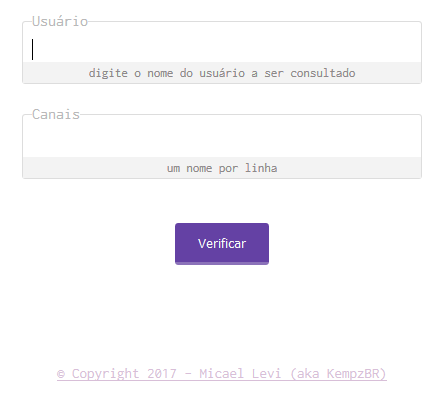

[](https://twitch-chat-checker.herokuapp.com/)
[](https://dependencyci.com/github/micalevisk/twitch-chat-checker-web)

# Twitch Chat Checker (web version)
**"Free app running time quota exhausted"**
<del>demo: [https://twitch-chat-checker.herokuapp.com/](https://twitch-chat-checker.herokuapp.com/)</del>




# API usage _(offline)_
> URL [twitch-chat-checker.herokuapp.com/](https://twitch-chat-checker.herokuapp.com/)~

| Endpoint            | Description |
| ------------------- | ----------- |
| [GET /:username/on/:channel]() | Get information about `username` & `channel` chat |

## Query parameter: `fields`
<table>
    <thead>
        <tr>
            <th>Name</th>
            <th>Description</th>
        </tr>
    </thead>
    <tbody>
	<tr>
            <td align="center"><code>_extra</code>
            <td>To show only extra informations.</td>
        </tr>
	<tr>
            <td align="center"><code>data</code>
            <td>To show only real Twitch TV API request.</td>
        </tr>
    </tbody>
</table>


### Example Request
```bash
curl -X GET https:/twitch-chat-checker.herokuapp.com/kempzbr/on/mydopefish
```

### Example Response
```json
{
	"_extra": {
		"solicitated_at": "2017-03-11T18:38:21.831Z",
		"from": "kempzbr",
		"to": "mydopefish",
		"online": true,
		"type": "viewer"
	},
  "chatter_count": 1,
  "chatters": {
		"moderators": [],
		"staff": [],
		"admins": [],
		"global_mods": [],
		"viewers": [
			"kempzbr"
		]
  }
}
```


## Browser Support

|  |  |  |
|:---:|:---:|:---:|
| 35+ ✔ | 38+ ✔ | 9+ ✔ |